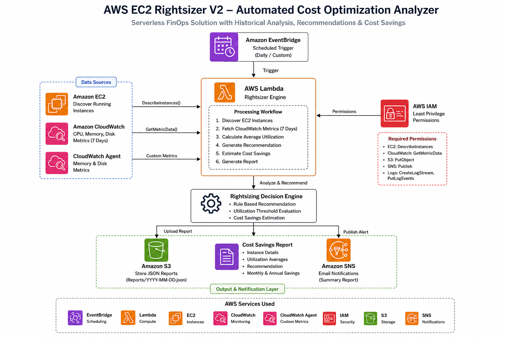
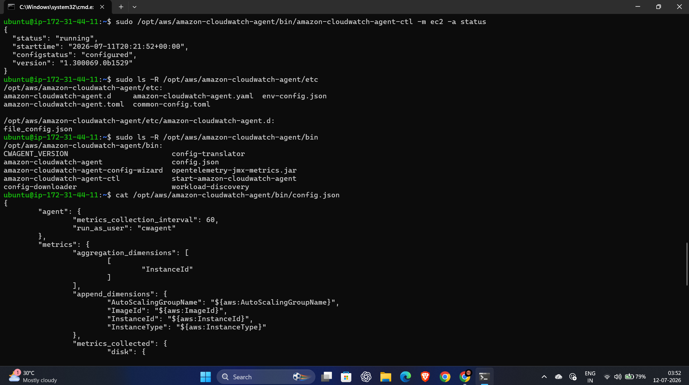

# RightSizer – Automated AWS EC2 Rightsizing & Cost Optimization

RightSizer is a serverless AWS FinOps solution that automatically discovers Amazon EC2 instances, analyzes historical utilization using Amazon CloudWatch metrics, generates intelligent rightsizing recommendations, estimates potential cost savings, stores reports in Amazon S3, and sends email notifications using Amazon SNS. The complete workflow is automated using Amazon EventBridge and AWS Lambda, enabling continuous infrastructure monitoring and cost optimization.

---

## Features

- Automated discovery of running Amazon EC2 instances
- Historical CloudWatch metrics analysis (Last 7 Days)
- CPU, Memory, and Disk utilization monitoring
- Intelligent rightsizing recommendation engine
- Monthly and annual cost savings estimation
- JSON report generation
- Automatic report storage in Amazon S3
- Email notifications using Amazon SNS
- Scheduled execution using Amazon EventBridge
- CloudWatch logging and monitoring
- Fully serverless architecture
- Modular Python implementation

---

## AWS Services Used

| Service | Purpose |
|----------|---------|
| Amazon EC2 | Discover and analyze running EC2 instances |
| Amazon CloudWatch | Collect historical utilization metrics |
| CloudWatch Agent | Publish Memory and Disk utilization metrics |
| AWS Lambda | Execute the complete rightsizing workflow |
| Amazon EventBridge | Automatically trigger Lambda on schedule |
| Amazon S3 | Store generated reports |
| Amazon SNS | Send email notifications |
| AWS IAM | Secure access and permissions |

---

# Architecture



---

# Project Workflow

```text
                  Amazon EventBridge
                 (Scheduled Trigger)
                         │
                         ▼
                 AWS Lambda Function
                         │
                         ▼
          Discover Running EC2 Instances
                         │
                         ▼
     Retrieve Historical CloudWatch Metrics
          CPU • Memory • Disk (7 Days)
                         │
                         ▼
       Generate Rightsizing Recommendation
                         │
                         ▼
         Estimate Monthly & Annual Savings
                         │
              ┌──────────┴──────────┐
              ▼                     ▼
     Generate JSON Report     Send SNS Email
              │
              ▼
      Upload Report to Amazon S3
              │
              ▼
      Execution Completed
```

---

# Project Structure

```text
RightSizer/
│
├── lambda/
│   ├── lambda_function.py
│   ├── config.py
│   ├── ec2_service.py
│   ├── cloudwatch_service.py
│   ├── recommendation_engine.py
│   ├── pricing.py
│   ├── cost_analyser.py
│   ├── report_generator.py
│   ├── s3_service.py
│   ├── sns_service.py
│   └── requirements.txt
│
├── architecture/
│   └── architecture-diagram.jpeg
│
├── screenshots/
│
├── README.md
└── .gitignore
```

---

# Module Description

| Module | Description |
|----------|-------------|
| lambda_function.py | Coordinates the complete serverless workflow |
| config.py | Stores configuration values and thresholds |
| ec2_service.py | Discovers running EC2 instances |
| cloudwatch_service.py | Retrieves historical CloudWatch metrics |
| recommendation_engine.py | Generates rightsizing recommendations |
| pricing.py | Stores EC2 pricing information |
| cost_analyser.py | Calculates monthly and annual savings |
| report_generator.py | Generates JSON reports |
| s3_service.py | Uploads reports to Amazon S3 |
| sns_service.py | Sends summary email notifications |

---

# Recommendation Logic

The recommendation engine analyzes the average CPU utilization over the previous seven days.

| Average CPU Utilization | Recommendation |
|-------------------------|----------------|
| Less than 10% | Stop Idle Instance |
| 10% – 30% | Downsize Instance |
| 30% – 70% | Keep Current Instance |
| Above 70% | Investigate High Utilization |

Memory and Disk utilization are also included in the report for additional operational insights.

---

# Cost Savings Estimation

The project estimates infrastructure savings using predefined monthly pricing for supported EC2 instance types.

| Recommendation | Estimated Savings |
|---------------|-------------------|
| Stop Idle Instance | 100% Monthly Cost |
| Downsize Instance | Approximately 50% Monthly Cost |
| Keep Current Instance | No Savings |
| Investigate High Utilization | No Savings |

Both monthly and annual savings are included in the generated report.

---

# Metrics Used

| Metric | Source | Used |
|---------|--------|------|
| CPU Utilization | Amazon CloudWatch | Recommendation Engine |
| Memory Utilization | CloudWatch Agent | Reporting |
| Disk Utilization | CloudWatch Agent | Reporting |

---

# Deployment Workflow

1. Launch an Amazon EC2 instance.
2. Attach an IAM role with CloudWatch permissions.
3. Install and configure the Amazon CloudWatch Agent.
4. Verify CPU, Memory, and Disk metrics in Amazon CloudWatch.
5. Create an Amazon S3 bucket.
6. Create an Amazon SNS topic and subscribe an email endpoint.
7. Create an AWS Lambda function.
8. Upload all project source files.
9. Configure Lambda environment variables.
10. Create an EventBridge scheduled rule.
11. Test the Lambda function.
12. Verify reports in Amazon S3 and notifications through Amazon SNS.

---

# Environment Variables

| Variable | Description |
|----------|-------------|
| BUCKET_NAME | Amazon S3 bucket name |
| SNS_TOPIC_ARN | Amazon SNS Topic ARN |

---

# Screenshots

## Lambda Function


---

## CloudWatch Dashboard


---

## Amazon S3 Reports


---

## Amazon SNS Notification


---

## EventBridge Rule


---

## Cloudwatch-agent



---

# Future Enhancements

- AWS Pricing API integration
- Historical trend analysis
- CSV and PDF report generation
- Interactive dashboard for report visualization
- DynamoDB integration
- Multi-region monitoring
- Automatic EC2 rightsizing using AWS Systems Manager
- Machine learning-based recommendation engine

---

# Technologies Used

- Python
- AWS Lambda
- Amazon EC2
- Amazon CloudWatch
- CloudWatch Agent
- Amazon EventBridge
- Amazon S3
- Amazon SNS
- AWS IAM
- Boto3

---

# Challenges Faced

During the development of RightSizer, several practical challenges were encountered and resolved:

- Configuring the Amazon CloudWatch Agent for Memory and Disk metrics
- Managing IAM permissions for secure access across AWS services
- Debugging Lambda import and runtime errors
- Handling CloudWatch metric availability and delays
- Configuring EventBridge scheduled execution
- Managing Lambda environment variables
- Designing a modular serverless architecture

Resolving these issues provided practical experience with AWS serverless development, cloud monitoring, debugging distributed systems, and FinOps-based infrastructure optimization.

---

# Learning Outcomes

This project provided practical experience with:

- AWS Lambda
- Amazon EC2
- Amazon CloudWatch
- CloudWatch Agent
- Amazon EventBridge
- Amazon SNS
- Amazon S3
- AWS IAM
- Serverless Architecture
- Infrastructure Automation
- Cloud Monitoring
- FinOps
- AWS SDK for Python (Boto3)

---


# Author

**Kishika Singh**
