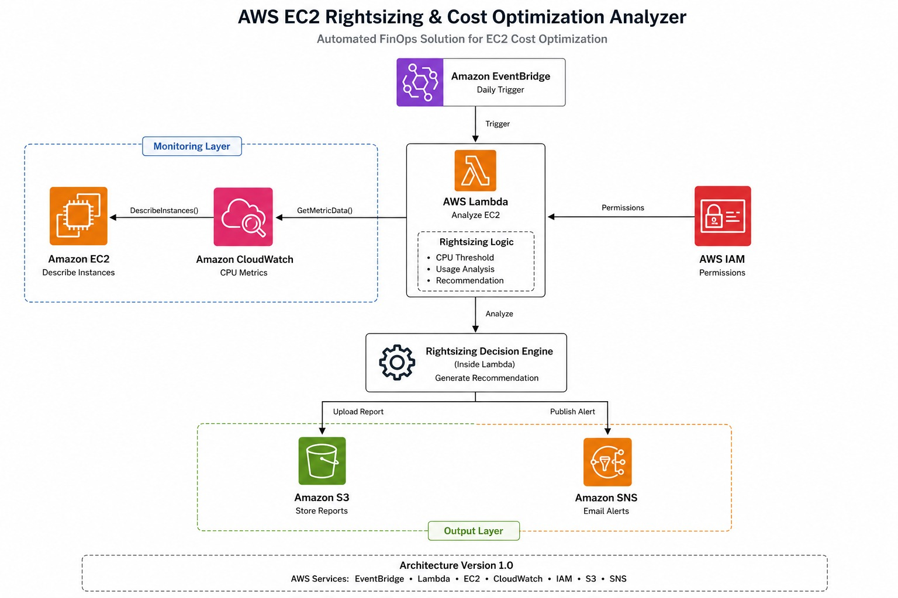
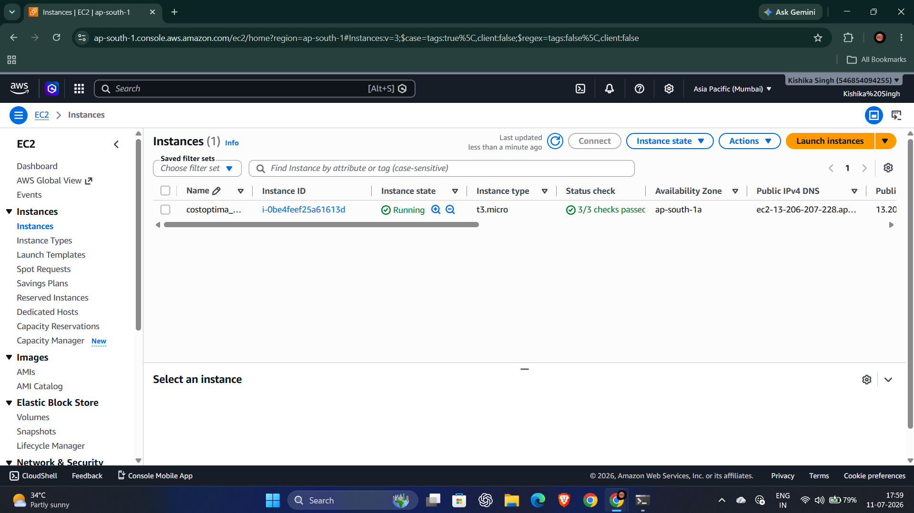
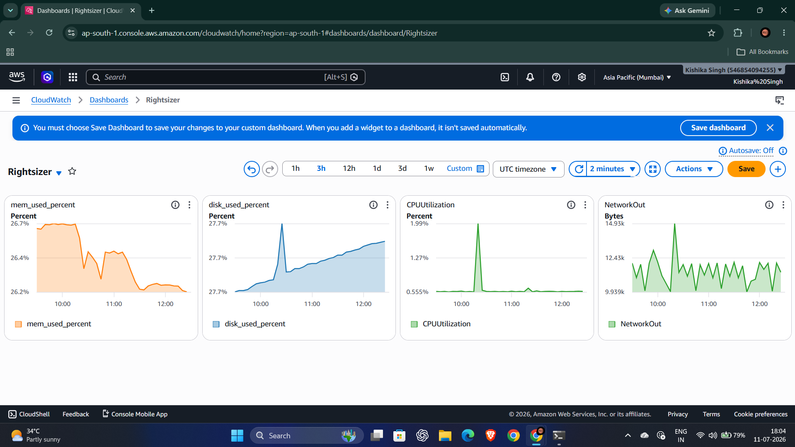
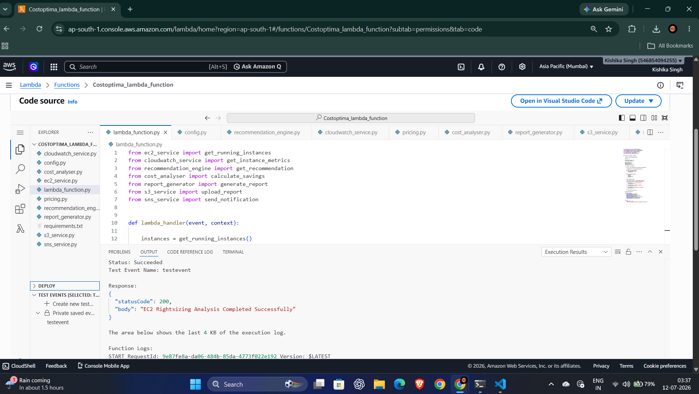
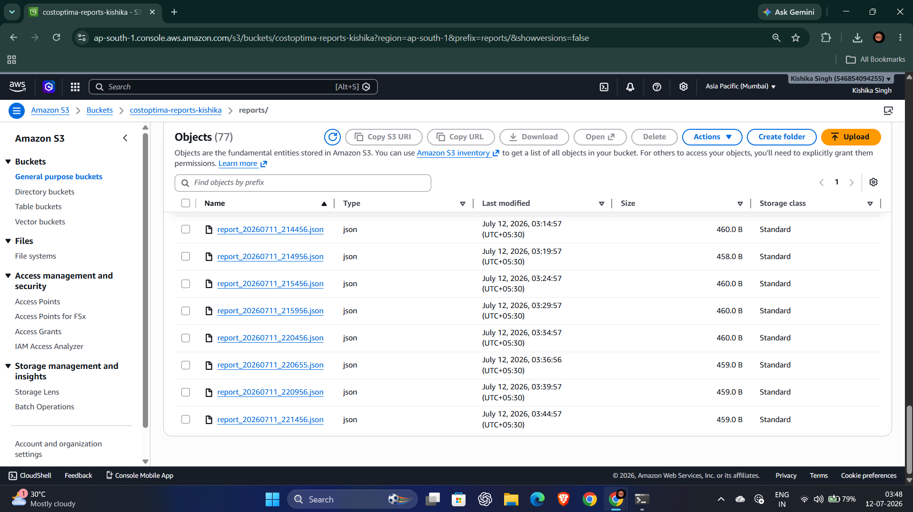
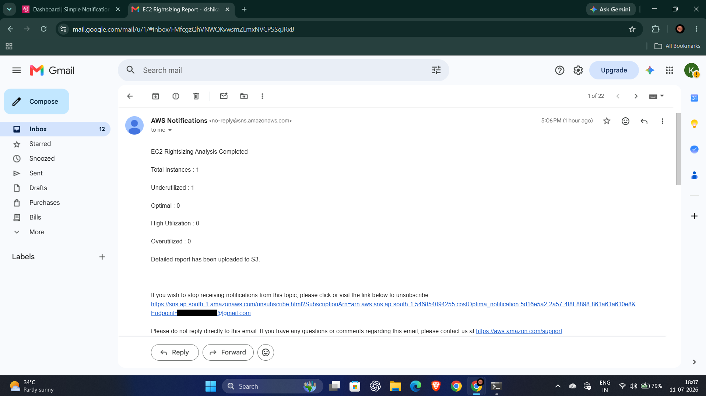
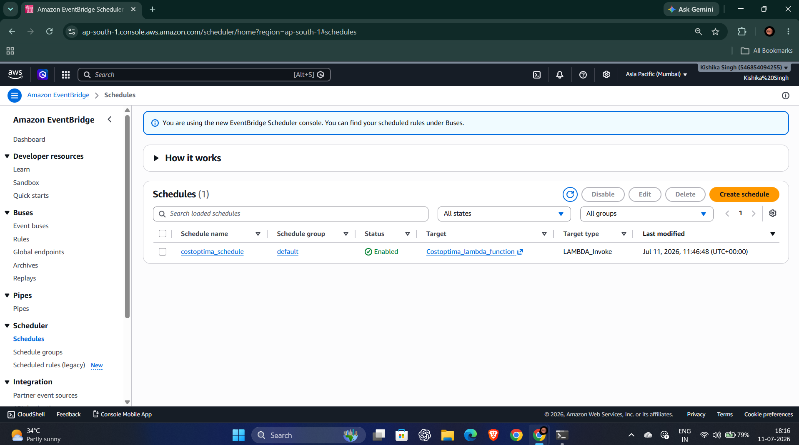

# EC2 Rightsizing & Cost Optimization Analyzer

A serverless AWS FinOps solution that automatically monitors Amazon EC2 instances, analyzes utilization using CloudWatch metrics, generates rightsizing recommendations, stores reports in Amazon S3, and sends email notifications through Amazon SNS. The entire workflow is automated using Amazon EventBridge and AWS Lambda.

---

## Features

- Automated EC2 monitoring every 5 minutes
- CPU, Memory, and Disk utilization analysis
- Weighted utilization scoring
- Rightsizing recommendations
- JSON report generation
- Report and log storage in Amazon S3
- Email notifications using Amazon SNS
- Fully serverless architecture
- Modular Python implementation

---

## AWS Services Used

| Service | Purpose |
|----------|---------|
| Amazon EC2 | Compute instances being monitored |
| Amazon CloudWatch | Collects CPU and network metrics |
| CloudWatch Agent | Publishes memory and disk metrics |
| AWS Lambda | Executes monitoring and analysis |
| Amazon EventBridge | Triggers Lambda every 5 minutes |
| Amazon S3 | Stores reports and logs |
| Amazon SNS | Sends email notifications |
| AWS IAM | Access management and permissions |

---

# Architecture



---

# Project Workflow

```text
                EventBridge
             (Every 5 Minutes)
                     │
                     ▼
             AWS Lambda Function
                     │
                     ▼
       Retrieve Running EC2 Instances
                     │
                     ▼
      Fetch CloudWatch Metrics
 CPU │ Memory │ Disk │ Network
                     │
                     ▼
      Weighted Utilization Analysis
                     │
                     ▼
     Generate Rightsizing Recommendation
                     │
        ┌────────────┴────────────┐
        ▼                         ▼
 Upload Report to S3      Send Email via SNS
        │
        ▼
   Execution Completed
```

---

# Project Structure

```text
ec2-rightsizing-analyzer/
│
├── lambda_code/
│   ├── lambda_function.py
│   ├── config.py
│   ├── ec2_service.py
│   ├── cloudwatch_service.py
│   ├── analyzer.py
│   ├── report_generator.py
│   ├── s3_service.py
│   ├── sns_service.py
│   └── requirements.txt
│
├── screenshots/
│
├── README.md
└── .gitignore
```

---

# Module Description

| Module | Description |
|----------|-------------|
| lambda_function.py | Main entry point that coordinates the workflow |
| config.py | Stores project configuration values |
| ec2_service.py | Retrieves running EC2 instances |
| cloudwatch_service.py | Fetches CloudWatch metrics |
| analyzer.py | Calculates utilization score and recommendation |
| report_generator.py | Creates JSON reports |
| s3_service.py | Uploads reports and logs to Amazon S3 |
| sns_service.py | Sends email notifications |

---

# Utilization Policy

| Overall Score | Status | Recommendation |
|--------------:|--------|----------------|
| 0 – 25 | Underutilized | Rightsize or Stop Instance |
| 25 – 70 | Optimal | No Action Required |
| 70 – 85 | High Utilization | Monitor Workload |
| 85 – 100 | Overutilized | Upgrade Instance |

---

# Metrics Used

| Metric | Source | Used in Analysis |
|---------|--------|------------------|
| CPU Utilization | Amazon CloudWatch | Yes |
| Memory Utilization | CloudWatch Agent | Yes |
| Disk Utilization | CloudWatch Agent | Yes |
| Network In | Amazon CloudWatch | Reporting Only |
| Network Out | Amazon CloudWatch | Reporting Only |

---

# Deployment Workflow

1. Launch an EC2 instance.
2. Install and configure the CloudWatch Agent.
3. Verify metrics in Amazon CloudWatch.
4. Create an Amazon S3 bucket.
5. Create an Amazon SNS topic and subscribe an email.
6. Create an IAM Role with required permissions.
7. Deploy the AWS Lambda function.
8. Configure Amazon EventBridge to trigger Lambda every 5 minutes.
9. Test the workflow.
10. Monitor reports and notifications.

---

# Screenshots

## EC2 Instance



---

## CloudWatch Dashboard



---

## Lambda Function



---

## Amazon S3 Reports



---

## Amazon SNS Notification



---

## EventBridge Scheduler



---

# Future Enhancements

- AWS Compute Optimizer integration
- AWS Cost Explorer integration
- Historical trend analysis
- CloudWatch Dashboard
- CSV/PDF report generation
- Web dashboard for report visualization
- Multi-region monitoring
- Automatic instance resizing using AWS Systems Manager

---

# Technologies Used

- Python
- AWS Lambda
- Amazon EC2
- Amazon CloudWatch
- CloudWatch Agent
- Amazon EventBridge
- Amazon S3
- Amazon SNS
- AWS IAM
- Boto3

---

# Author

**Kishika Singh**
